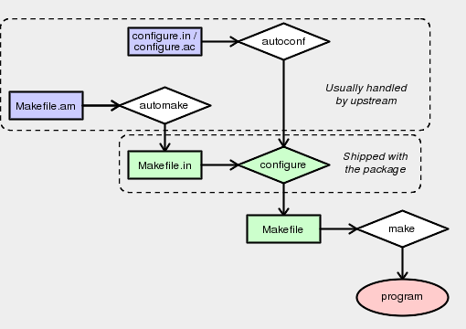

The Basics of Autotools
=======================

.. Todo:: This is too long for `General Concepts`_. It needs to be split up and
  moved somewhere, either to a top-level of its own or into `Appendices`_.

An understanding of GNU autotools (``automake``, ``autoconf`` etc) can be useful
when working with ebuilds:

* Finding and correcting build issues is often easier if the build system is
  not seen simply as a scary black box.
* The autotools input files can help when determining a package's build-time
  dependencies.
* The risk of accidentally breaking something by patching the wrong file at the
  wrong time is greatly reduced if the relationship between the build system
  files is understood.

Major Autotools Components
--------------------------

Autotools is a collection of related packages which, when used together, remove
much of the difficulty involved in creating portable software. These tools,
together with a few relatively simple upstream-supplied input files, are used to
create the build system for a package.

    A basic overview of how the main autotools components fit together

In a simple setup:

* The ``autoconf`` program produces a ``configure`` script from either
  ``configure.in`` or ``configure.ac`` (see note below).
* The ``automake`` program produces a ``Makefile.in`` from a ``Makefile.am``.
* The ``configure`` script is run to produce one or more ``Makefile`` files from
  ``Makefile.in`` files.
* The ``make`` program uses the ``Makefile`` to compile the program.

.. Note:: The ``configure.in`` name used to be standard. However, the GNU
  documentation now recommends ``configure.ac`` as it is more obvious which
  program should be used when processing it. The files perform the same purpose
  and have the same format -- the only difference is the name.

You will see autotools being used variously in both ``src_unpack`` and
``src_compile``. The QA people prefer it in ``src_unpack`` -- the rationale is
that ``src_unpack`` handles "getting the package ready to be compiled" -- but
there is no official policy which mandates this.

The ``autoreconf`` tool supposedly runs ``autoconf`` (and ``automake``,
``autoheader``, ``aclocal``, ``autopoint`` and ``libtoolize``) as necessary.
Sometimes it works. Some packages ship a shell script named ``autogen.sh`` which
does the same thing (this is *not* related to ``autogen``).

.. Warning:: You must **not** attempt to modify any of the generated files in
    between running ``configure`` and ``make``. This can lead to autotools
    trying to be clever and recreate the files, in turn leading to your changes
    being removed. In some situations this will also result in ``./configure``
    arguments being silently dropped, which can give broken dependencies.
    The best way to proceed is usually to work with the ``.ac`` / ``.in`` files
    instead.

Simple Autotools Patching Example
---------------------------------

The following snippet illustrates the correct way to proceed after patching
either ``Makefile.am`` or ``configure.ac``:

.. CODESAMPLE patching-1.ebuild

The ``einfo`` message before running autotools is not mandatory. However, these
steps can sometimes take a while and may produce no output, so it may make sense
to let the user know that something is still happening. See `Messages`_.

The ``configure.ac`` File
-------------------------

The ``configure.ac`` file is used to create the ``./configure`` script. It
consists of a series of macros which are processed and expanded by ``autoconf``.
These macros can check for packages and libraries, handle ``--enable`` and
``--with`` switches, and generate various files.

Basic Format of ``configure.ac``
''''''''''''''''''''''''''''''''

The ``configure.ac`` file is a basic text file. Indenting and whitespace are
largely irrelevant. Comments are indicated by the string ``dnl`` (``dnl`` is
actually a macro which discards the remainder of the input -- it stands for
"discard new line").

If the previous sentence made you uneasy, you should probably stop reading this
page. It gets far worse.

A typical file might start with something like the following:

.. CODESAMPLE autoconf-1.txt

The ``AC_PREREQ`` line, if present, tells you which ``autoconf`` version you
need. This is useful, because ``autoconf`` is not compatible between versions.
In the above example, we need ``=autoconf-2.5*``, and we should
``export WANT_AUTOCONF="2.5"`` (or use the ``autoconf-2.59`` script) when calling
``autoconf``.

The ``AM_INIT_AUTOMAKE`` line tells us which ``automake`` version we need.
Again, there is little chance that an ``automake-1.7`` script will work properly
with ``automake-1.8``. Setting ``WANT_AUTOMAKE="1.8"`` in the environment can be
used to make an unversioned ``automake`` call run the correct version.

.. Note:: The ``WANT_`` variables are a Gentoo feature that originally came from
  Mandrake. Other distributions may handle things differently.

Usually, some standard checks will follow:

.. CODESAMPLE autoconf-2.txt

For non-standard applications, you may also see manual checks:

.. CODESAMPLE autoconf-3.txt

You may also see checks for compiler features:

.. CODESAMPLE autoconf-4.txt

Library and header checks:

.. CODESAMPLE autoconf-5.txt

And function checks:

.. CODESAMPLE autoconf-6.txt

Often these will be all jumbled together without any useful comments. In some
cases, many of the checks done won't even be necessary for the application in
question -- most autotools code is copy/pasted rather than written from scratch,
and ``autoscan`` (a tool which helps write ``configure.ac``) is sometimes
over-eager to add in checks.

The file will finish with some output functions:

.. CODESAMPLE autoconf-7.txt

These are used to make the ``./configure`` script generate the relevant files.

Enable and Disable Checks
'''''''''''''''''''''''''

So far we've only seen 'hard' dependencies. Many packages have *optional*
support for various extras (graphics toolkits, libraries which add
functionality, interpreters, features, ...). This is (if we're lucky) handled
via ``--enable-foo`` and ``--disable-foo`` switches to ``./configure``, which
are generated from ``autoconf`` rules.

A simple ``--enable`` / ``--disable`` function might look something like the
following:

.. CODESAMPLE autoconf-8.txt

Sometimes more complicated checks are included based upon whether or not an
option is enabled. There are also some predefined macros which include
``AC_ARG_ENABLE``, so grepping ``configure.ac`` for ``AC_ARG_ENABLE`` may not
give a complete list. A better way is to use ``./configure --help`` and check
the output.

.. Important:: The third argument is used when a ``--enable`` or ``--disable``
    switch to ``./configure`` is provided, and the fourth is used when such a
    switch is *not* passed. A common misconception is that the third is enable
    and the fourth is disable -- this is **not** the case. You may encounter
    packages that get this wrong.

A simple way to check that a package is using this macro properly is to
install the optional dependency, and then try all of ``./configure``,
``./configure --enable-foo`` and ``./configure --disable-foo``. If the second
and third runs give the same results, something is wrong. If the first run gives
a *different* result to the second and third, there is a good chance that a
misunderstanding of the ``AC_ARG_ENABLE`` arguments is to blame.

With and Without Checks
'''''''''''''''''''''''

A simple ``--with`` / ``--without`` check might look like:

.. CODESAMPLE autoconf-9.txt

Again, the third argument is for 'specified' and the fourth for 'not specified',
and there are standard macros which include ``with`` options.

Automatic Checks
''''''''''''''''

It's possible to write autoconf rules which bypass the manual enable / disable
convention (or which just ignore what the user asks for). If your package does
this, it must be fixed to avoid dependency problems.

The most common form is packages which simply use ``AC_CHECK_LIB`` to decide
whether or not to enable a feature. If you find a package which does this, you
**must** change the behaviour.

Quoting Rules for ``configure.ac``
''''''''''''''''''''''''''''''''''

Behind the scenes, ``autoconf`` makes heavy use of the ``m4`` macro processor to
do the work. The ``m4`` quote characters are set by ``autoconf`` to be ``[`` and
``]`` for opening and closing quotes respectively. Using ``"`` or ``'`` may
produce unexpected results.

To include a literal left square bracket, the easiest thing to do is to use the
special string ``@<:@``. For a right bracket, use ``@:>@``.

For example:

.. CODESAMPLE quoting-1.txt

gives: ::

    the first
    the second
    "the third"
    [the fourth]
    [the fifth]

When in doubt, it is generally safest to quote macro arguments using ``[ ]``
rather than leaving things unquoted.

The ``Makefile.am`` Files
-------------------------

The ``Makefile.am`` file is processed by ``automake`` to create ``Makefile.in``,
which is in turn processed by ``configure`` to create ``Makefile``, which is in
turn used by ``make`` to build the software.

The basic format is like that of a ``Makefile``. However, you will see various
'special' variables being set, rather than every rule being written manually.

A very simple example:

.. CODESAMPLE automake-1.txt

All the standard GNU rules will be generated, so ``make``, ``make clean``,
``make distclean``, ``make dist`` and so on will all work here.

You may also see some standard ``Makefile`` constructs showing up whenever there
isn't a standard ``automake`` way of handling a certain task. For example:

.. CODESAMPLE automake-2.txt

Here, the ``@regex_cmd@`` variable will be substituted with whatever
``configure`` detects (``sed`` in this case) when creating the ``Makefile``.
This is handled via the macro ``AC_SUBST(VARNAME)`` in ``configure.ac``.

Makefile Variables
''''''''''''''''''

Sometimes, badly behaved ``Makefile.am`` files will override user variables such
as ``CFLAGS``. This must not be allowed -- see `Not Filtering Variables`_. There
are separate special variables which should be used in these situations -- for
setting ``CFLAGS``, for example, a ``Makefile.am`` should use ``AM_CFLAGS`` so
that user preferences are not ignored.

So, if a ``Makefile.am`` contains, say: ::

    CFLAGS="-Wall"

You should ``sed`` or ``patch`` it to use: ::

    AM_CFLAGS="-Wall"

Remember to manually run ``autoconf`` then ``automake`` if you do this.

The ``config.h.in`` File
------------------------

The ``config.h.in`` file is generated by ``autoheader``. You shouldn't have to
worry about this usually, but occasionally you may need to run ``autoheader``
manually as part of the build process if upstream do not ship a pre-generated
version.

``aclocal`` and ``m4`` Files
----------------------------

In the ``configure.ac`` or ``configure.in`` files you can call not only the
default macros defined by ``autoconf`` and ``automake``, but also other
functions which can be defined by specific packages like libraries and programs
to check for their features in the correct manner.

Those functions are (usually) defined in ``m4`` files placed in
the ``/usr/share/aclocal`` directory by packages. Problems can arise when you
need to regenerate the ``autotools`` files, because the functions used by the
``configure.ac`` file can be defined in an ``m4`` macro file which isn't
installed on the user's system. This is the case for example for some optional
features which require libraries and are disabled by ``USE`` flags. If the
``m4`` files aren't installed in the user's system, the ``autoconf`` step will
fail.

To resolve this, most packages just ship the ``m4`` macro files needed for their
``configure.ac`` in an ``m4`` subdirectory in the source package. Unfortunately,
not all ``m4`` directories are complete, even if they are present.

In those cases you need to find out the ``m4`` file, usually installed by the
dependency in ``/usr/share/aclocal``, and make sure that the ``src_unpack``
stage both makes available those files to the autotools and calls ``aclocal`` to
recreate the ``aclocal.m4`` file which is used by ``autoconf`` when creating the
configure script.

Usually it's more than one ``m4`` file which is missing, so you probably want to
package them in a tarball, and add it to ``SRC_URI``. After making sure that the
tarball is extracted somewhere in ``${WORKDIR}`` (say, in a ``gentoo-m4``
directory), you usually have two general ways to handle those macro files, one
for packages which ships with an incomplete ``m4`` directory and one for
packages which ships without the ``m4`` directory.

In the first case you usually want to do something like:

.. CODESAMPLE aclocal-1.ebuild

and so on. In the second case you can simplify it in this way:

.. CODESAMPLE aclocal-2.ebuild

without need to copy the files.

It's always better inform upstream when the needed ``m4`` files are missing in
the distribution, asking them to add all the needed files in the source tarball
to avoid version conflicts if the macro changes.

Libtool
-------

.. Todo:: Stuff about libtool, libtoolize, elibtoolize, libtool.eclass. Which I
  know almost nothing about... Yay!

Further Autotools Reading
-------------------------

For more details on autotools:

* The book "GNU Autoconf, Automake and Libtool" by Gary V. Vaughan, Ben
  Elliston, Tom Tromey  and Ian Lance Taylor   (often called "The Autobook")
  provides a good but somewhat outdated description of autotools. It is
  `freely available online <http://sources.redhat.com/autobook/>`_.

* The GNU documentation for the various autotools components is of varying
  quality and completeness:

  + `GNU automake Manual
    <http://www.gnu.org/software/automake/manual/automake.html>`_
  + `GNU autoconf Manual <http://www.gnu.org/software/autoconf/manual/>`_
  + `GNU libtool Manual <http://www.gnu.org/software/libtool/manual.html>`_
  + `GNU m4 Manual <http://www.gnu.org/software/m4/manual/m4.html>`_

* There are some good overview lectures available online. `These slides
  <http://vipe.technion.ac.il/~shlomif/lecture/Autotools/slides/>`_ are one
  example.

.. vim: set ft=glep tw=80 sw=4 et spell spelllang=en : ..
