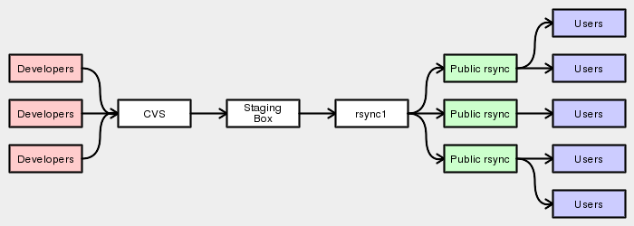

CVS to RSYNC
============

Changes made to the tree are propagated to the users in stages:

* Developer commits to CVS.

* Staging box syncs from CVS and generates the metadata cache.

* ``rsync1`` syncs from the staging box.

* Public rsync servers sync from ``rsync1``.

* Users sync from the public rsync servers.

    Diagram showing CVS to RSYNC Propagation

The ``emerge-websync`` snapshot is made daily from the staging box.

.. vim: set ft=glep tw=80 sw=4 et spell spelllang=en : ..
