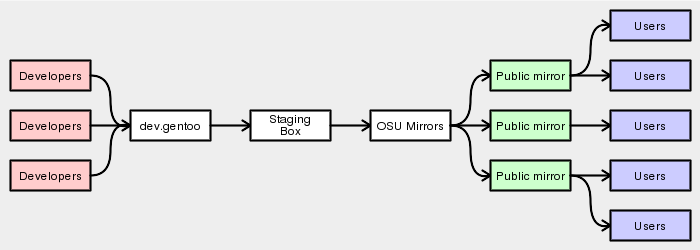

Mirrors
=======

Automatic Mirroring
-------------------

Packages will automatically have their ``SRC_URI`` components mirrored onto
Gentoo mirrors.  When fetching, portage checks Gentoo mirrors first before
trying the original upstream location.

This is generally desired behaviour -- upstream mirrors are prone to being
rearranged, tidied out or having files modified.

Restricting Automatic Mirroring
'''''''''''''''''''''''''''''''

Three ``RESTRICT`` keywords can be used to control the mirroring process.

The ``RESTRICT="nomirror"`` setting should be used if we cannot legally mirror
certain files.

The ``RESTRICT="primaryuri"`` setting causes portage to try
original locations *first*, and then fall back to mirrors if necessary -- this
is sometimes useful if approximate download counts are needed, or if upstream
have a reliable mirror setup.

There is also ``RESTRICT="fetch"``, which prevents portage from trying to
fetch anything manually. The `pkg_nofetch`_ function will be called if any
``SRC_URI`` components cannot be found. This should only be used if a licence
requires it.

Suitable Download Hosts
'''''''''''''''''''''''

Hosting files off ``dev.gentoo.org`` is **not** acceptable for main-tree items.
Instead, these files must be moved onto ``mirror://gentoo`` before release.

Gentoo Mirrors
--------------

To manually upload a file to ``mirror://gentoo``, ``scp`` it to
``dev.gentoo.org:/space/distfiles-local``. You must ensure that the permissions
are set to ``ug+rw`` manually. The file should appear on the mirrors within four
hours (note that this is *less frequent* than `CVS to rsync`_).

If the upstream download location for a package uses a non-standard TCP port
(anything other than 21, 80 or 443), you *must* manually mirror the files. Not
doing so can cause all kinds of problems with strict firewalls.

Mirroring Process
-----------------

    Diagram showing the mirroring process

.. vim: set ft=glep tw=80 sw=4 et spell spelllang=en : ..

